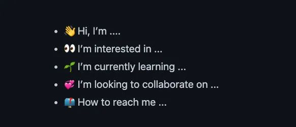
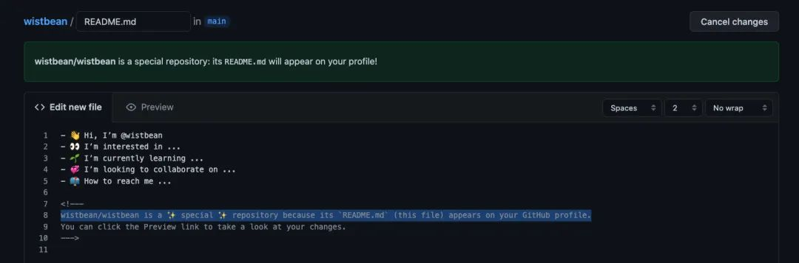
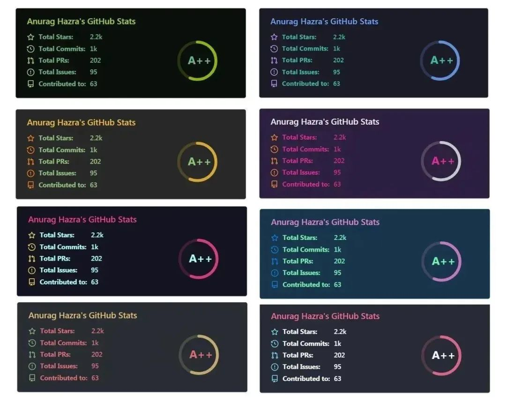
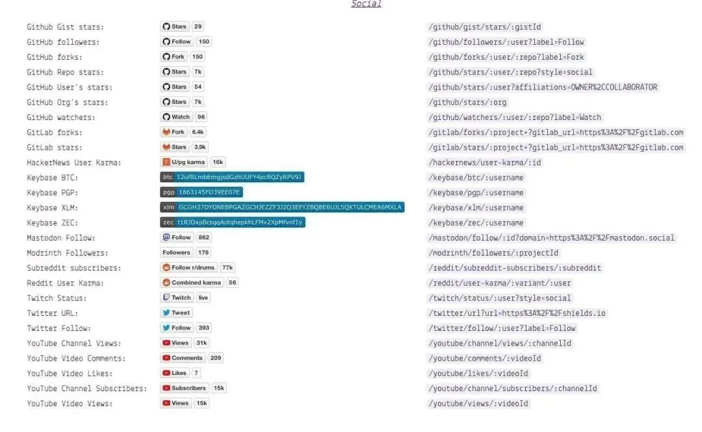
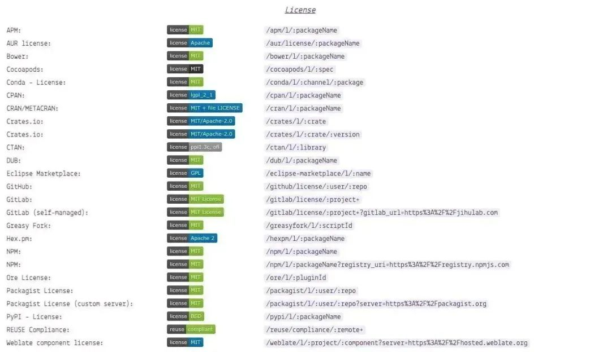
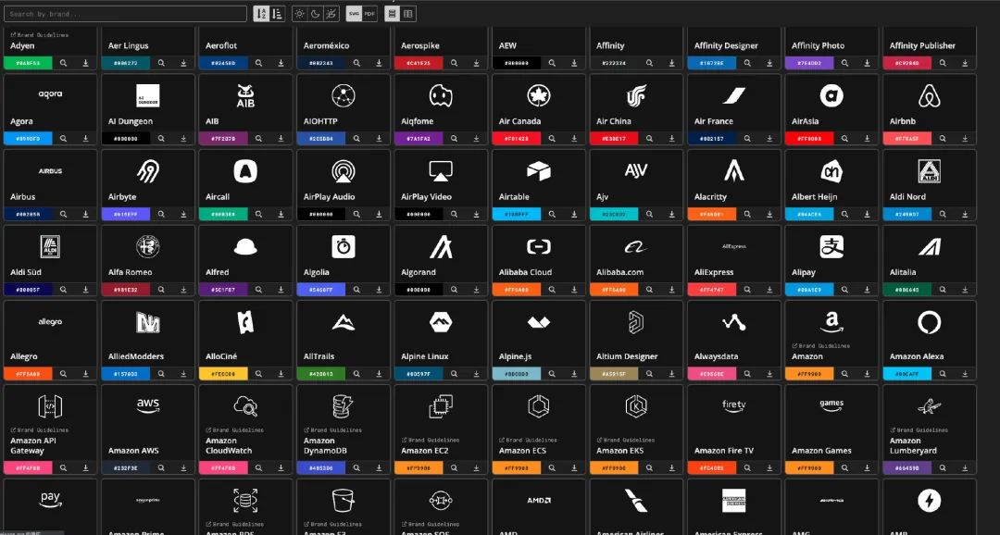
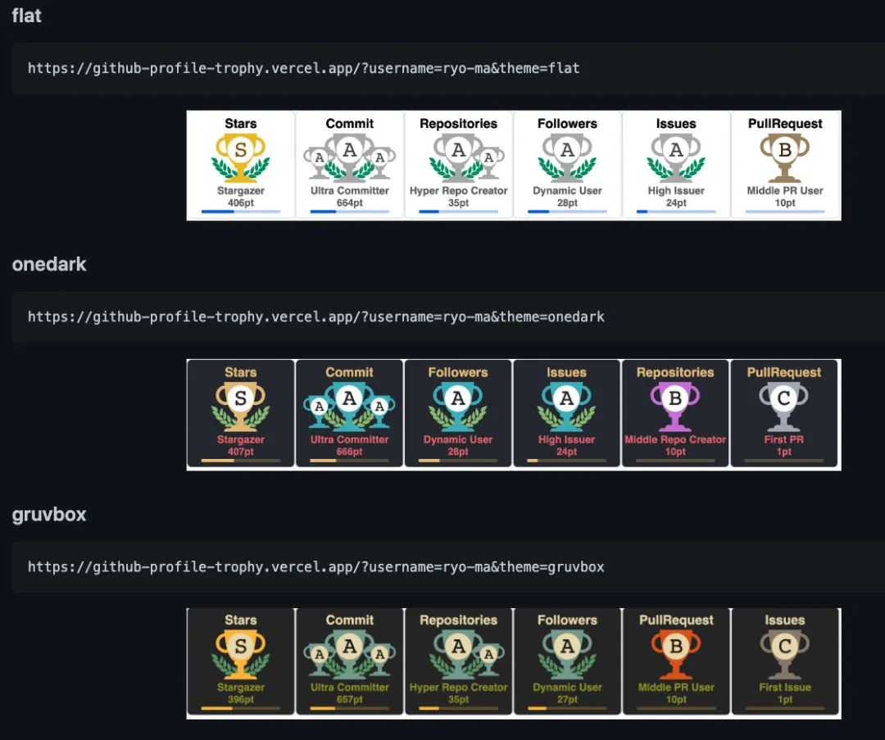
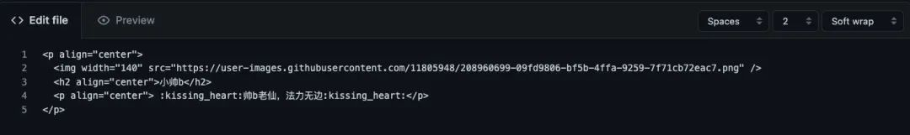
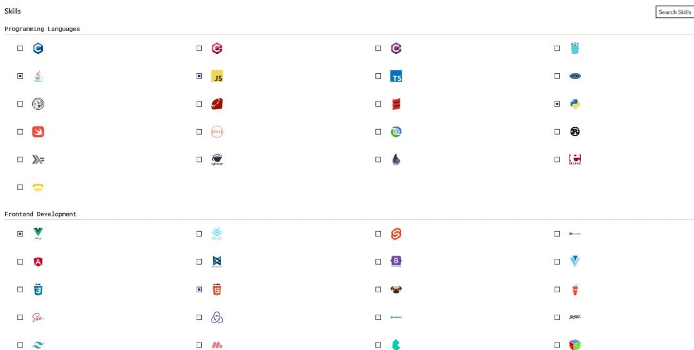
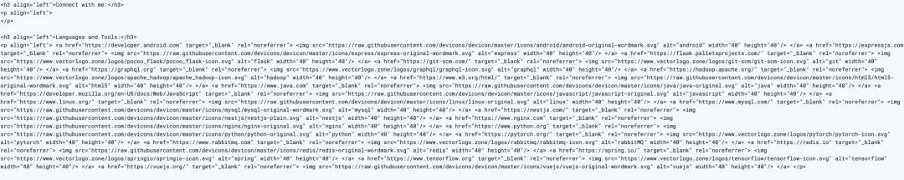

# 教你打造一个优雅的 GitHub 主页

> 原创：小帅b 

如果你经常逛 GitHub，你应该会发现，有些人的 GitHub 主页弄得好帅啊，比如这样的：

这样的：

还有这样的：

等等等等...

而你的却是这样的：

这，你能忍？是我我忍不了！

哈哈，没错，今天就来教你打造一个优雅的 GitHub 主页，把逼装了再说。

## 一、创建你的主页

首先，你可以进入你的 GitHub，创建一个和你*用户名相同*的仓库，然后在里面创建 README 文件。

由于你这个仓库名和你的用户名是相同的，所以这个仓库就变得比较特殊了。

因为你在这里面的 README 写东西，都会显示到你的 GitHub 主页上。

## 二、美化的工具

如果你会点 `MarkDown` 或 `HTML 语言`，那么你基本就可以在自己的 `README` 中 diy 自己的主页了。

但是没有一些好看好玩的素材，是不是会显得有点单调？

来，给你推荐一些不错的素材。

### 2.1 emoji

在这里有许多 emoji 的符号代码，你可以直接将它们用到 README 中。

> https://www.webfx.com/tools/emoji-cheat-sheet/

### 2.2 GitHub 统计卡片

在这里有不同主题的 GitHub 统计卡片，可以统计到你的 star，commit 等数据。

> https://github.com/anuraghazra/github-readme-stats/blob/master/docs/readme_cn.md

以及你使用到的编程语言统计：

### 2.3  各种按钮

在这里有许多按钮样式可以使用。

> https://shields.io/

比如 Stars，Fork：

比如 License 等：

### 2.4 显示你最近的状态

在这里可以显示你最近在 GitHub 上面做了些什么。

> https://github.com/jamesgeorge007/github-activity-readme

### 2.5 一堆图标

在这里还有一大堆图标可以直接使用。

> https://simpleicons.org/

### 2.6 展示奖杯

在这里可以统计 GitHub 的数据，并以奖杯的形式展现。

> https://github.com/ryo-ma/github-profile-trophy/blob/master/README.md

### 2.7 更多素材资源

上面这些基本够你用了，如果你还想找更多的素材，可以到这里的 Tool 找到：

> https://github.com/abhisheknaiidu/awesome-github-profile-readme#tools

## 三、开始去造吧

有了以上的资源，就可以根据自己的喜欢，打造自己的 GitHub 主页啦。

你可以直接在 GitHub 上一边编辑一边预览。

当然了，你还可以在当前仓库上传自己的图片，然后在 README 里面引用它们。

比如我就上传了自己的头像，然后让它显示并居中：

 

还可以将 GitHub 统计给怼进去，方法也很简单，只要将 username 改为你自己的 GitHub 用户名就可以了：

 

对了，如果你懒得收集各种图标展示到你的主页上，你还可以直接在这里直接一键生成！！

> https://rahuldkjain.github.io/gh-profile-readme-generator/

随便勾选几下：

然后点击生成就会直接生成相应的代码：

用就是了：

对于其他素材的使用方式，你可以直接参照相应文档食用，还是很方便的。

每个人都有自己喜欢的风格，我喜欢简洁一点，你完全可以根据自己的喜欢去 DIY，反正只要会点简单的 HTML 或 MARKDOWN 足矣。